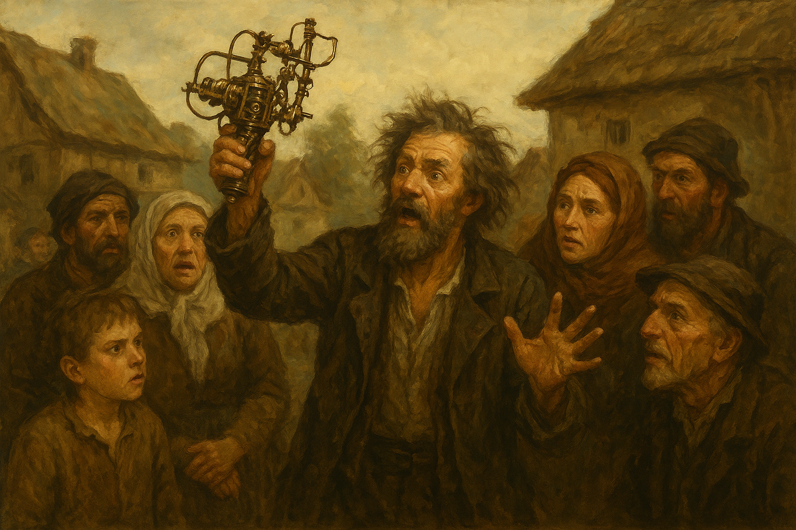
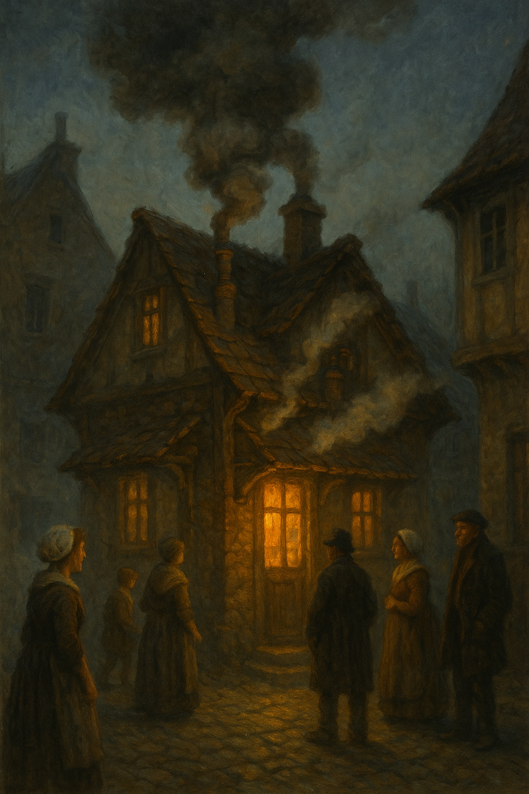
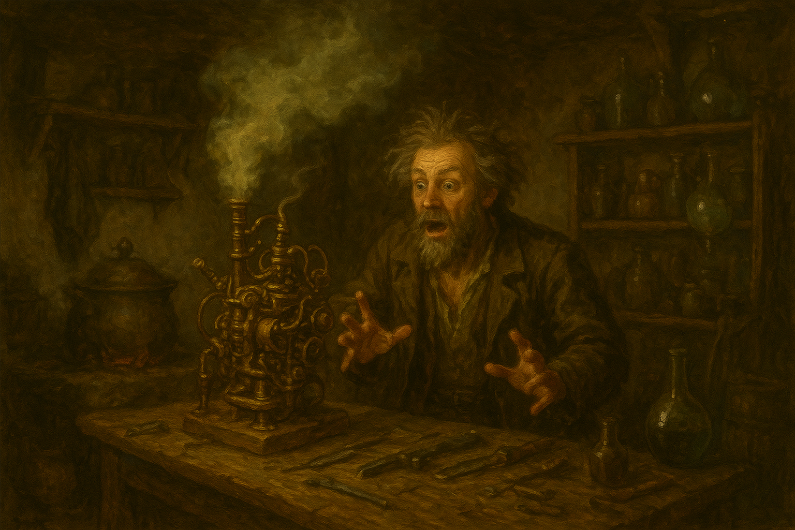
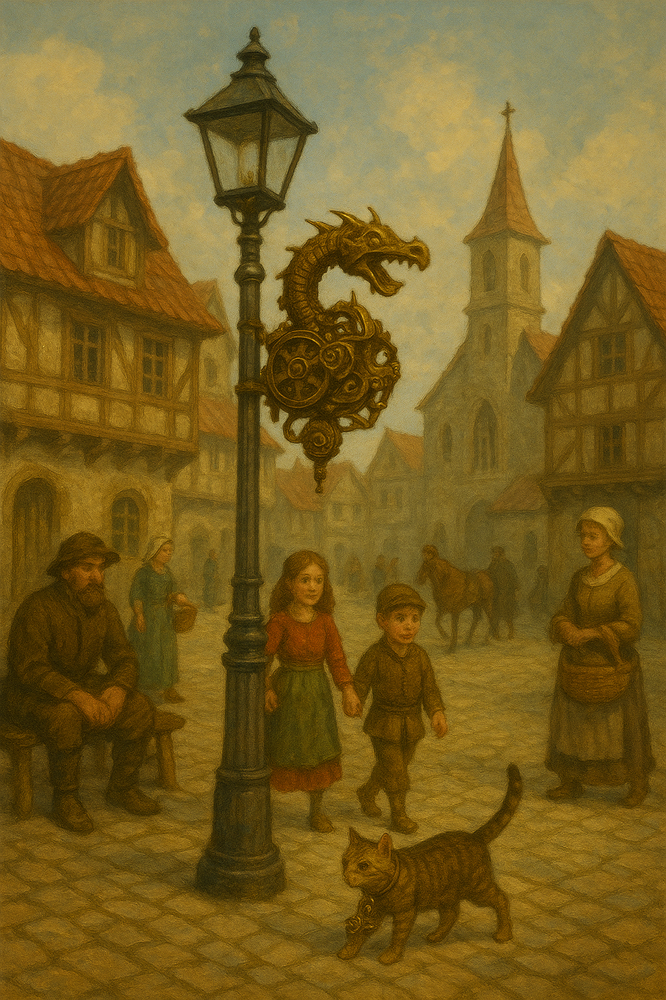
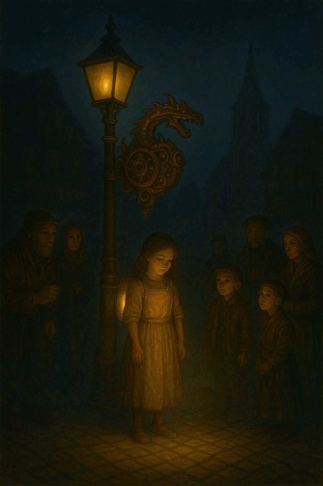
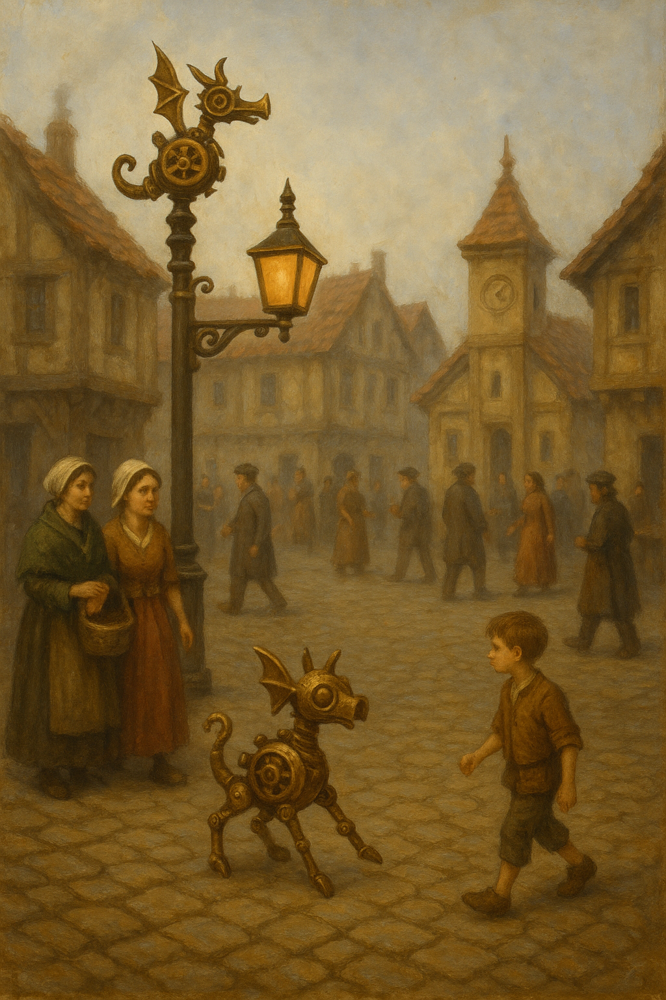
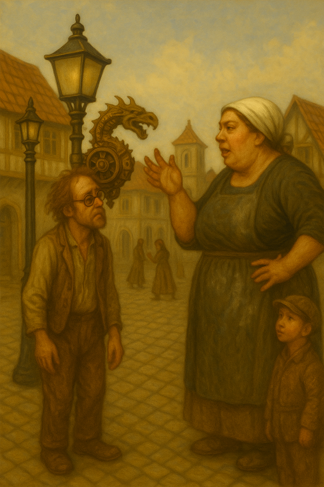
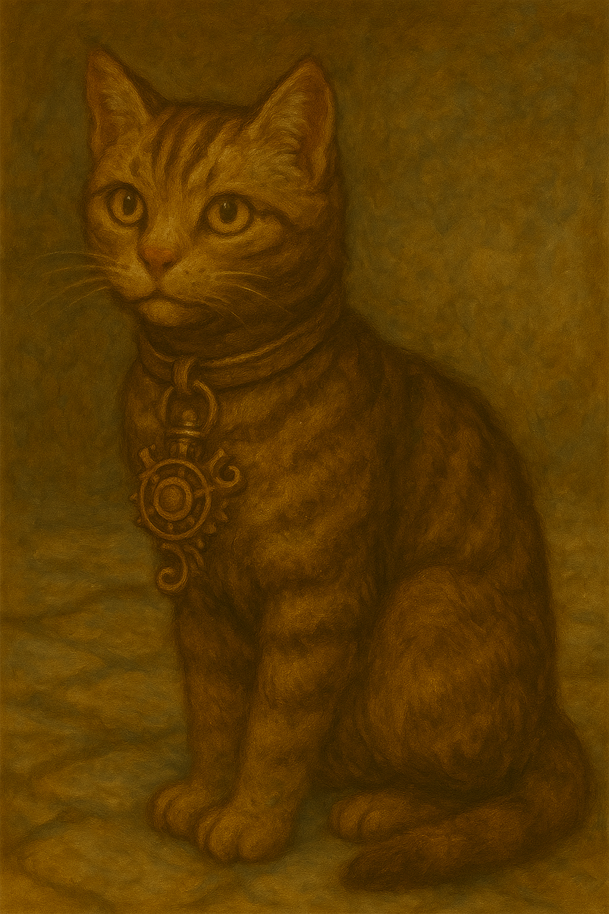

# The Dragon Alarm That Cried Whoosh
## The False Positive Paradox

In the quiet town of Puddleford, everyone slept soundly — except for TinkerTom Toddle, who stayed up inventing things.

One foggy morning, he ran through the town square shouting,
“Good people of Puddleford! Behold — the Dragon Alarm!
If a dragon comes within a mile, this device will shriek and flash!”

The townsfolk gasped.
“Will it work?” asked Millie the Baker.
“Of course!” said TinkerTom. “It’s very reliable. Hardly ever wrong!”

"Amazing! We need one for every house in town. No dragon will sneak up on this town again" declared the sheriff.

So TinkerTom went back to his workshop. Many strange sounds and smells wafted from the Toddle workshop. But sure enough...

## 1 Year Later

The very next year, the good people of Puddleford had Dragon Alarms on rooftops, lampposts, chicken coops, and even on TinkerTom's cat.
Every device was polished and primed — ready to save the town from fiery doom.

That night, as the fog rolled in and the crickets tuned their legs, a noise echoed through the valley:
WHOOSH! FLASH! WAIL!

“The alarm! The Dragon Alarm!” cried Millie the Baker, spilling flour everywhere.
“The dragons are upon us!” shouted the sheriff, tripping over his boots.

The townsfolk rushed into the square, armed with broomsticks and teapots. But all that stood there was little Nellie, the blacksmith's young daughter, with a flashing backpack.

They searched the sky, the hills, and even the mayor’s chimney.
But there was nothing — except a rather nervous barn owl who’d sneezed too loudly.

The seasons passed.

## Some Years Later
WHOOSH! FLASH! WAIL! again.
Everyone ran out once more.
Only to find the laundry flapping on the line.

And you know what happens next.

The townsfolk barely looked up from their porridge.
“Oh, it’s just the wind,” muttered the grocer.
Even the mayor started keeping earplugs under his hat.

From that day on, the Dragon Alarms of Puddleford were put to better use —
as lanterns, as clocks, and once, as a very effective popcorn popper.
And once even, as a mechanical hopper.

And whenever TinkerTom started a new invention, Millie would say,
“Remember, TinkerTom — if something almost never happens, even the best alarm will mostly be wrong about it.”

TinkerTom nodded wisely, then whispered,
“Still… just in case, I’ll keep one on the cat.”

And on that cat, there was a WOOSH! FLASH! WAIL!
TinkerTom's cat exploded out the workshop and went deep underground.
A funny smell passed through the town.
A vast shadow swept over Puddleford — wings wide as rooftops, scales shining like coins in the sun.

And that was the last of Puddleford town.

The End
